# Kennedy Mwangi

|  |
|:--:|
| [](https://github.com/Mkid095) |

**Digital Solutions Architect  -  CEO, [Next Mavens](https://www.nextmavens.com)**  -  Nairobi, Kenya

[](https://linkedin.com/in/Kennedy-Mwangi)
[](https://www.nextmavens.com)
[](https://x.com/Mkid095)
[](mailto:kennedygithinjioffice@gmail.com)

---

## About Me

I'm **Kennedy Mwangi**, Digital Solutions Architect and CEO of [Next Mavens](https://www.nextmavens.com), building production platforms across **SaaS**, **AI infrastructure**, and **developer tooling**.

I work across the full product lifecycle — architecture, backend systems, frontend experiences, deployment infrastructure, and AI integration — with a particular focus on developer-facing tools and infrastructure that make complex systems simple to operate.

```javascript
const kennedy = {
  name:       "Kennedy Mwangi",
  role:       "Digital Solutions Architect",
  title:      "CEO & Founder",
  company:    "Next Mavens",
  location:   "Nairobi, Kenya",

  focus: [
    "Full-Stack Engineering",
    "AI Systems & Orchestration",
    "SaaS Architecture",
    "Developer Tooling",
    "Cloud & VPS Infrastructure"
  ],

  philosophy: "Build systems that are powerful underneath and simple to use."
};
```

> *"AI came to create opportunities and not to pet jobs, it just made things faster."*

---

## Pinned Projects

*Auto-updated daily via GitHub Actions.*

<!-- PROJECTS:START -->

### [next-mavens-flow](https://github.com/Mkid095/next-mavens-flow)
No description

**Shell**  - **1** stars

---

### [nextmavens-control-plane-api](https://github.com/Mkid095/nextmavens-control-plane-api)
Control Plane API service for NextMavens platform

**TypeScript**  - **1** stars

---

### [-next-mavens-fidscript-whatsapp-api-console](https://github.com/Mkid095/-next-mavens-fidscript-whatsapp-api-console)
No description

**TypeScript**  - **0** stars

---

### [claude](https://github.com/Mkid095/claude)
No description

**-**  - **0** stars

---

### [eurabay-living-system-ui](https://github.com/Mkid095/eurabay-living-system-ui)
Project from Orchids.app - eurabay-living-system-ui

**Python**  - **0** stars

---

### [fidscript-deploy](https://github.com/Mkid095/fidscript-deploy)
start

**TypeScript**  - **0** stars

<!-- PROJECTS:END -->

---

## Technology Stack

| Category | Technologies |
|---|---|
| **Languages** |     |
| **Frontend** |     |
| **Backend** |    |
| **Databases** |   |
| **Infrastructure** |     |
| **AI & Automation** |   |
| **Tools** |     |

---

## GitHub Statistics

*Auto-updated daily via GitHub Actions.*

<!-- STATS:START -->







**0** commits this month  - **74** public repos  - **0** private repos  - **7** followers  - **3** stars  - **0** all-time commits
<!-- STATS:END -->

---

## Engineering Philosophy

| Principle | Description |
|---|---|
| **Architecture before implementation** | Understand the system before building individual features |
| **Automation over repetition** | If a process happens repeatedly, it should become infrastructure |
| **Validate before proceeding** | Each phase of a build is confirmed working before moving to the next |
| **Observability over guesswork** | Production systems should make failures visible and explain what happened |
| **User experience over complexity** | The system can be complicated internally. The user shouldn't have to care |

---

## Let's Connect

**Kennedy Mwangi**  -  Digital Solutions Architect  -  CEO, Next Mavens  -  Nairobi, Kenya

Open to collaboration on **AI infrastructure**, **developer platforms**, **SaaS architecture**, and **automation**.

*Technology should empower people, not complicate their lives.*

> *"AI came to create opportunities and not to pet jobs, it just made things faster."*
